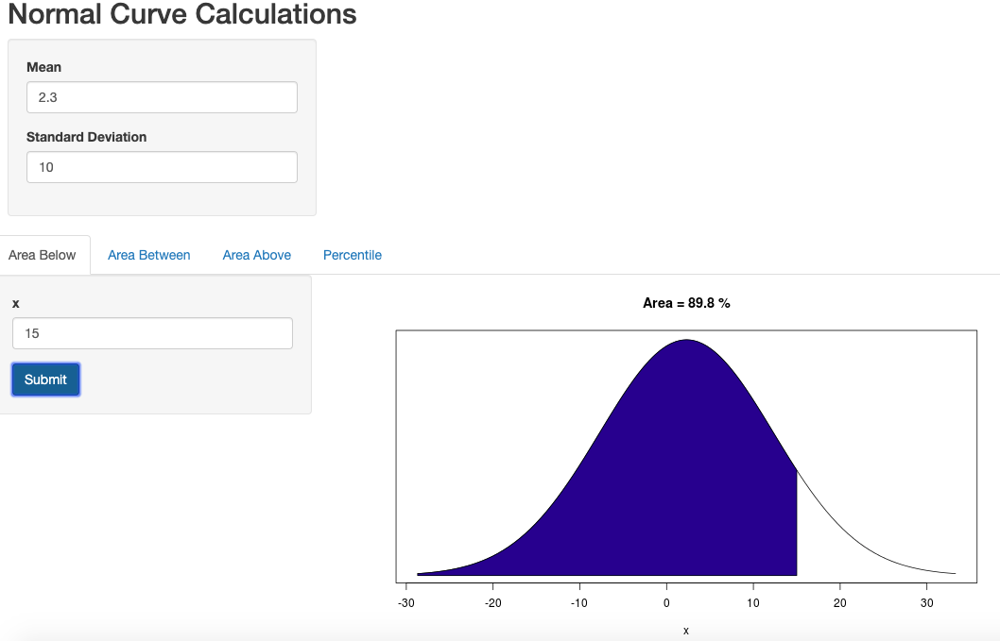
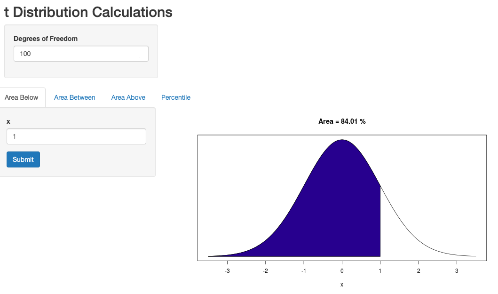
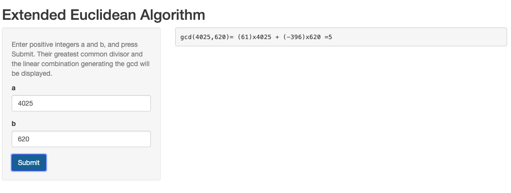
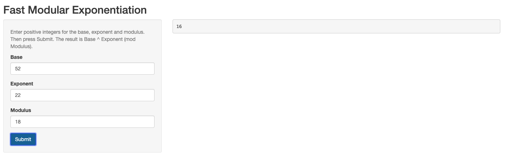

# ShinyPrograms
Los Medanos Shiny Applications
## Overview
The following programs are in support of the Los Medanos statistics classes. Currently (fall semester 2019), these classes are
listed as Math 110 and Math 110 + Math 110S, but in the past they were offered as several flavors of Math 34 and Math 27.

There are also two programs useful for Discrete Mathematics (Los Medanos Math 160). The first of these uses the extended Euclidean
algorithm to display the linear combination of two positive integers, giving their greatest common divisor. The second performs
fast modular exponentiation.

The Shiny application framework was developed by RStudio, who hosts the web site lmcstatistics.shinyapps.io, and each application
comprises two R programs ui.R and server.R. For an introduction to Shiny, see the Shiny website 
(http://shiny.rstudio.com).

A description of each application follows.
### Statistics Applications
#### **NormalCalc** (http://lmcstatistics.shinyapps.io/NormalCalc)
  A calculator for finding areas and percentiles for the normal distribution.

#### **TCalc**   (http://lmcstatistics.shinyapps.io/TCalc)
  A culculator for finding areas and percentiles for the T distribution.

  
#### **Groups** (http://lmcstatistics.shinyapps.io/Groups)
  Takes classroom attendance and generates random student groups based on attendance. Requires a *.txt file as input, with one student per line in the file.
  
#### **RectSample** (http://lmcstatistics.shinyapps.io/RectSample)
  Supports the random rectangle experiment from earlier versions of the LMC statistics packets by automating the random selection and averaging of selected rectangle sizes.

biasedcoin  (http://lmcstatistics.shinyapps.io/biasedcoin)

catvcat   (http://lmcstatistics.shinyapps.io/catvcat)

### Discrete Mathematics Applications
#### **Euclid**    (http://lmcstatistics.shinyapps.io/Euclid)
  Finds the GCD of two positive integers along with the linear combination of these integers that yields the GCD. 

  
#### **modpower**  (http://lmcstatistics.shinyapps.io/modpower)
  Fast modular exponentiation of integer base, exponents and modulus.

  
